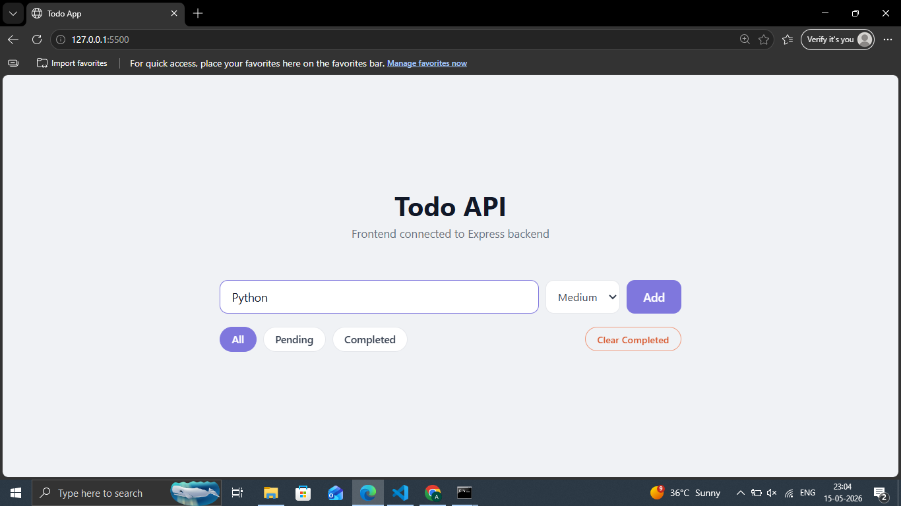

# Day 24 — In-Memory To-Do API

A full-stack todo app with Express backend and frontend connected via fetch.

## Preview


## Features
- Full CRUD API for todos
- Filter by status and priority
- Toggle complete/pending
- Clear all completed todos
- Live stats — total, done, pending
- Priority badges — High, Medium, Low
- Frontend talks to backend via fetch

## How to Run
```bash
npm install
node server.js
```
Open `http://localhost:3000`

## API Routes
| Method | Route | Description |
|--------|-------|-------------|
| GET | /todos | Get all todos |
| GET | /todos?status=pending | Filter todos |
| POST | /todos | Create todo |
| PUT | /todos/:id | Update todo |
| PATCH | /todos/:id/toggle | Toggle complete |
| DELETE | /todos/:id | Delete todo |
| DELETE | /todos/clear/completed | Clear completed |
| GET | /stats | Get stats |

## Tech Stack
- Node.js + Express (backend)
- HTML + CSS + JavaScript (frontend)
- Fetch API (frontend to backend)

## What I Learned
- Serving static files with express.static
- Connecting frontend to backend with fetch
- PATCH method for partial updates
- Building a complete full-stack app

## Part of
[30 Days 30 Projects](https://github.com/anmisha-dash/30-days-30-projects) challenge